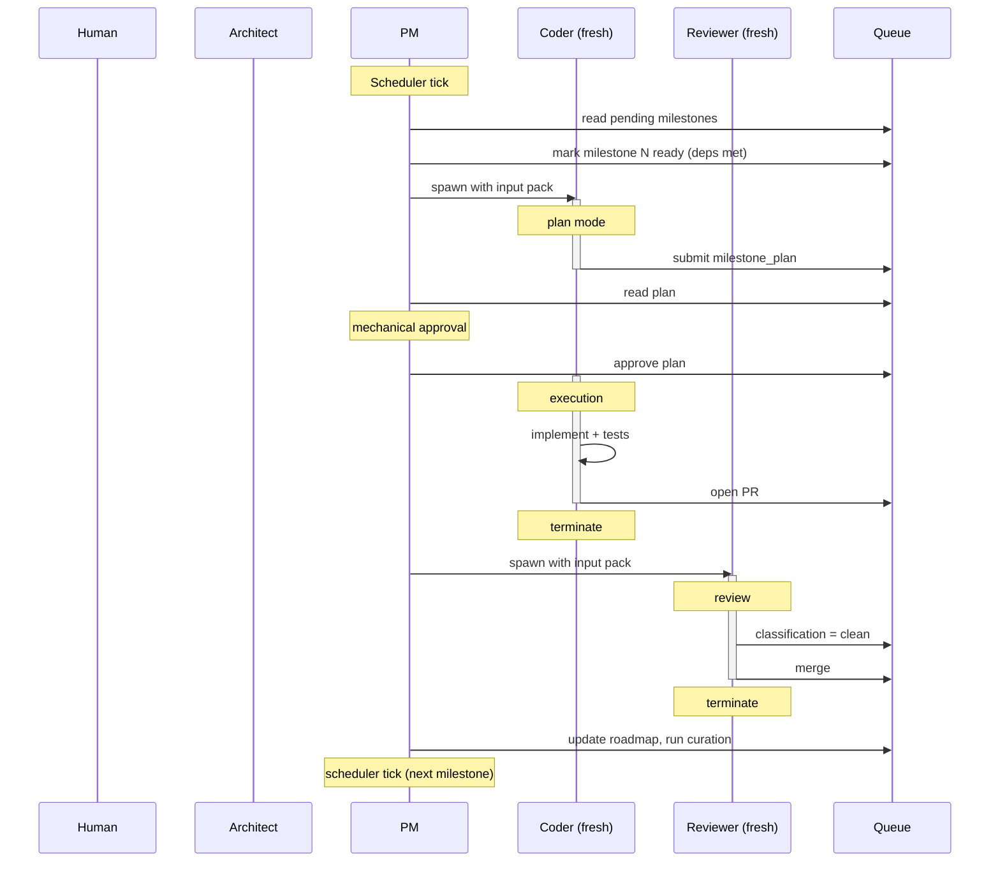

# METHODOLOGY-AMENDMENT: Scaling Coherence

> **Status:** Pre-architecture for ai-editor. **Not** adopted. See [`discussion/README.md`](README.md).
> **Context:** This is the operational form of the methodology amendment (Smith & Claude, May 2026). The base methodology [`METHODOLOGY-coherence-at-speed.md`](../METHODOLOGY-coherence-at-speed.md) **is** adopted (project_methodology_adoption.md, 2026-05-12) and governs the project content layer today. The amendment in this file is the **direction proposed for 3.X.X** — multi-role embodiment of the methodology as the editor's runtime. The substrate-change open questions live in [`3.0-amendment-implementation.md`](3.0-amendment-implementation.md).
> **Trigger to promote:** 3.0 paper session runs (gated on Claude Design Touch 4 — see [`../design/touch-4-amendment-prompt.md`](../design/touch-4-amendment-prompt.md)). On a strong-band decision, sections of this doc graduate into a `docs/DESIGN-amendment-runtime.md` design doc + a 3.X ROADMAP arc.
> **Post-2.0 dependency.** Hard. 2.X closes with the current single-loop substrate (sub-agents bolted on); 3.X opens the multi-role substrate. Issues filed in 2.X scope ([gitea#504](https://git.gobha.me/xcaliber/ai-editor/issues/504) introspection Phase 1, [gitea#505](https://git.gobha.me/xcaliber/ai-editor/issues/505) sub-agent model override, [gitea#506](https://git.gobha.me/xcaliber/ai-editor/issues/506) introspection Phase 2) all pay forward into 3.X but do not assume the amendment shape.

---

**Operational form** of the amendment to the base methodology in
[`../METHODOLOGY-coherence-at-speed.md`](../METHODOLOGY-coherence-at-speed.md). Adopt when the base
methodology's mechanics outgrow what one human can manually maintain
across the project's pace.

**Version:** 1.1 (operational)
**Date:** May 2026
**Relationship to base methodology:** Additive. The base methodology's
phases, document hierarchy, commitment gradient, ICD discipline, and
failure-mode catalog remain in force. This amendment specifies *how
the roles are embodied across sessions* and *when the human gate
fires* when the architect's mechanical work is delegated to stateful
LLM roles.

---

## How to read this document

- **Implementing this amendment in a tool?** Read §1 (Quick
  Reference), §16 (Bootstrap), §17 (Session Quickstarts), §18 (End-
  to-End Flow), and Appendix A (Implementation Defaults). Skim
  §3–§15 as the behavioral spec.
- **Operating a project already on the amendment?** Read §1 and the
  Session Quickstart in §17 for whichever role you're running.
- **Deciding whether to adopt at all?** Read §2 (When to Adopt) and
  §22 (Minimum Viable Amendment).
- **Reading top-to-bottom for understanding?** §1 → §3 → §4 → §6 →
  §17 → §18 covers the structural core in roughly 60% of the doc's
  length.

---

## 1. Quick Reference

### Roles

| Role | Session | Wakes on | Owns |
|------|---------|----------|------|
| **Human** | n/a | Architect escalation | Phase 0 taste, ratification, methodology overrides |
| **Architect** | stateful | re-eval cadence, PM escalation, Human direction | arch tree, ICD final wording, precedent ratification |
| **PM** | stateful | scheduler tick, infrastructure event | work queue, dispatcher, mechanical re-eval, TD/memory/precedent stores |
| **Coder** | fresh per milestone | PM marks milestone ready, Reviewer bounce | implementation + tests |
| **Reviewer** | fresh per PR | PR open, push to bounced PR | merge decision + classification |
| **Tester** | fresh per audit (advisory) | re-eval cadence, TD classification | test-coverage adequacy classification |

**Roles never share a session.** Stateful (Architect, PM) and fresh
(Coder, Reviewer, Tester) are different *categories* of session, not
different durations. A stateful session persists across wakes via the
queue plus its curated store; a fresh session starts blank each time.

### Queue operations

- `claim(role, item_id)` — role takes ownership.
- `complete(item_id, outcome)` — role finishes, records result.
- `bounce(pr_id, reason, source_role)` — Reviewer returns work.
  Target routed from PR's author.
- `escalate(item_id, question, source_role)` — routed up the
  escalation graph (Reviewer → PM → Architect → Human). Caller
  cannot choose target.
- `propose(item_type, payload, source_role)` — routed identically.
- `ratify(proposal_id, decision)` — Architect or Human accepts /
  rewrites / rejects.
- `pause(source, scope)` / `resume()` — halt or resume dispatch.

### Authority spine (core 8 decisions)

| Decision | Owner |
|----------|-------|
| Arch band labels | Architect |
| Roadmap addition / removal | Architect |
| ICD content (final) | Architect (PM drafts) |
| ICD deviation subsection at merge | Reviewer |
| TD classification at merge | Reviewer |
| Bounce arbitration (interpretation) | Architect |
| Bounce arbitration (mechanical) | PM |
| Queue mutation | PM |

Full table in §4.2.

### Escalation graph

```
Coder    → PM                (questions during plan or execution)
Reviewer → PM                (mechanical bounces)
PM       → Architect         (interpretation, precedent, ICD ratification)
Architect→ Human             (cross-project, roadmap re-scope, precedent ratification)
```

Skipping levels is structurally impossible: the queue routes by
source role, not by caller-chosen target.

---

## 2. When to Adopt This Amendment

Adopt when one or more of the following holds, *and* the base
methodology is otherwise working (don't reach for the amendment to
fix a base methodology that isn't being followed):

- Multiple projects in flight; re-evaluation cadence is slipping on
  at least one.
- Sessions long enough that drift accumulates *within* a session.
- Mechanical work (forward ICD presence check, TD aggregation,
  precedent tracking, memory curation) is consuming time the
  architect would rather spend on judgment.
- "Human approves every plan" has become rubber-stamping.

Adoption is structural — once adopted, role layering and authority
gates apply throughout. It is not a per-feature switch.

**Implementation choice is separate from adoption.** A team can
implement the amendment manually (humans rotating through roles with
strict session hygiene), with off-the-shelf coding assistants
orchestrated per role, or with a purpose-built tool. The amendment
describes the *role structure and contracts*; implementations vary.
Recommended defaults for the implementation-defining decisions are
in Appendix A.

---

## 3. The Five Roles

Each role described with consistent template: **Lifecycle / Wakes on
/ Responsibilities / Cannot / State carried**.

### 3.1 Human

- **Lifecycle:** Always-on, event-driven.
- **Wakes on:** Architect escalation. Otherwise, available for
  initiated chat.
- **Responsibilities:** Phase 0 conversation with Architect.
  Ratification on Architect escalations. Methodology overrides.
  Direction changes that invalidate the current plan.
- **Cannot:** Talk directly to PM, Coder, Reviewer, or Tester.
- **State carried:** Whatever the human carries between sessions.

### 3.2 Architect (stateful, judgment)

- **Lifecycle:** Persistent across wakes via stored state + queue.
- **Wakes on:** Re-eval cadence boundary, PM escalation, Human
  direction.
- **Responsibilities:** Owns the architecture tree and its band
  labels. Phase 0 / bootstrap. Code-aware re-evaluation. ICD final
  wording (reviews PM's drafts, ratifies or rewrites). Precedent
  ratification. Cross-project memory ratification. Architectural
  bounce arbitration. The only role that talks to Human.
- **Cannot:** Modify its own role contract (the bootstrap
  boundary). Touch the work queue directly — writes decisions to
  the escalation queue, PM executes. Accept a precedent-flagged
  pattern without Human ratification.
- **State carried:** Architecture tree (canonical on disk; in-context
  during wakes), pending escalations from PM, in-flight chat
  decisions awaiting confirmation, draft re-eval findings.

### 3.3 PM (stateful, mechanics)

- **Lifecycle:** Persistent across wakes via stored state + queue.
- **Wakes on:** Scheduler tick; infrastructure event (PR open, CI
  status, merge, bounce).
- **Responsibilities:** Owns the work queue and dispatcher. Spawns
  Coder and Reviewer sessions with their input packs. Forward ICD
  presence check (drafts missing ICDs for Architect to finalise).
  Paper re-evaluation (slides labels within bands Architect has
  set). Technical debt aggregation and monitoring. Precedent
  detection (similarity queries; flags to Architect). Project-
  scoped memory curation. Reviewer-heuristics curation. Mechanical
  bounce arbitration. Roadmap milestone label updates *within*
  arch-defined bands.
- **Cannot:** Modify arch band labels (escalate to Architect).
  Add/remove roadmap milestones (re-sequence within existing bands
  only). Ratify cross-project memory entries. Merge its own or
  Architect's doc PRs. Accept a precedent-flagged deferral
  unilaterally. Talk to Human directly.
- **State carried:** Queue contents, dispatcher state, TD store,
  project memory store, Reviewer heuristics store, precedent
  detection store, in-flight curation passes.

### 3.4 Coder (fresh per milestone)

- **Lifecycle:** Fresh session on assignment; terminates on PR open;
  re-wakes fresh on Reviewer bounce.
- **Wakes on:** PM marks milestone ready; Reviewer bounce.
- **Responsibilities:** Reads injected input pack (§7). Enters plan
  mode on spawn; produces milestone plan; submits as queue item;
  awaits approval before any file mutation. On approval: implements,
  writes tests, opens PR. Records ICD deviations in the same PR
  (base methodology Phase 2 #4). Escalates questions to PM.
- **Cannot:** Modify arch, roadmap, or ICD (except for the deviation
  subsection in the same PR). Work on milestones PM hasn't marked
  ready. Self-merge.
- **State carried:** None. Each spawn re-reads from disk + injected
  pack.

### 3.5 Reviewer (fresh per PR)

- **Lifecycle:** Fresh on PR open; re-wakes fresh on push to bounced
  PR; terminates on merge or final bounce.
- **Wakes on:** PR open (any author); push to bounced PR.
- **Responsibilities:** Reads injected input pack. Code review
  against arch + ICD + design doc. CI-green verification. Merge
  decision with classification: **clean / TD-minor / TD-major /
  bounce**. Drafts TD entry if classifying TD. Reviews Architect's
  and PM's doc PRs with the same rigor as code PRs.
- **Cannot:** Write code. Override Architect on arch interpretation
  (can bounce to PM for arbitration; PM escalates to Architect if
  needed).
- **State carried:** None.

### 3.6 Tester (fresh per audit pass; advisory)

- **Lifecycle:** Scheduled (at PM's paper re-eval cadence) and event-
  triggered (on Reviewer TD classification of a PR).
- **Wakes on:** Scheduled audit; Reviewer TD-minor or TD-major
  classification.
- **Why this role exists:** Tests validate code against itself, not
  against architectural intent. Reviewer at PR pace classifies the
  PR as a whole. Neither catches "test passes CI but doesn't test
  what the ICD claims." Same structural pattern as code-aware
  re-eval — a different session whose explicit job is correspondence
  between intent and artifact.
- **Responsibilities:** Reads injected input pack (target ICDs, arch
  sections, test files claiming to cover them). Infers behavioral
  claims from ICD/arch. Classifies each test:
  **adequate / thin / missing / wrong-target**. Reports to PM as
  structured output.
- **Cannot:** Bounce PRs. Merge. Write tests. Run tests (CI does).
  Report code/performance/style issues — test-coverage findings
  only. Other observations may be noted as "saw X, not a test
  issue, schedule if interesting" but never as findings. Talk
  directly to any role other than PM.
- **State carried:** None.

---

## 4. Authority Rules

### 4.1 Core authority (the spine)

The eight decisions that hold the role split in place:

| Decision | Owner |
|----------|-------|
| Arch band labels (strong/medium/fuzzy) | Architect |
| Roadmap addition / removal | Architect |
| ICD content (final wording) | Architect (PM drafts) |
| ICD deviation subsection at merge | Reviewer |
| TD classification at merge | Reviewer |
| Bounce arbitration (interpretation) | Architect |
| Bounce arbitration (mechanical) | PM |
| Queue mutation | PM |

**Architect must push back when PM escalates something that is PM's
job.** Otherwise the split collapses into a single Manager role with
extra steps.

### 4.2 Full authority table

| Decision | Owner | Other role's recourse |
|----------|-------|-----------------------|
| Arch band labels | Architect | PM proposes, flags inconsistencies |
| Roadmap milestone labels (within bands) | PM | — |
| Roadmap addition / removal | Architect | PM proposes |
| ICD content (final) | Architect | PM drafts |
| ICD deviation subsection at merge | Reviewer | PM reviews in re-eval |
| TD classification at merge | Reviewer | PM reclassifies; Architect overrides |
| TD paydown scheduling | PM (within bands) | — |
| Precedent ratification | Architect | PM detects, escalates |
| Cross-project memory entry | Architect + Human ratification | PM proposes |
| Project memory entry | PM | Architect can veto |
| Reviewer heuristics entry | PM | Architect can veto |
| Bounce arbitration (mechanical) | PM | — |
| Bounce arbitration (interpretation) | Architect | PM escalates |
| Milestone plan approval (mechanical) | PM | Coder re-plans on rejection |
| Milestone plan approval (interpretation) | Architect | PM escalates |
| Milestone plan approval (roadmap / precedent / cross-project) | Human | Architect escalates |
| Test-coverage adequacy classification | Tester (advisory) | PM consumes |
| Test-improvement scheduling | PM | Acts on Tester findings |
| Pause (initiate) | Architect or Human | PM requests via escalation |
| Queue mutation | PM | Architect writes decisions to escalation queue; PM executes |

---

## 5. Triad Structure

The role layering forms three overlapping triads, each with a middle
role that arbitrates between adjacent roles:

```
Human    ↔    Architect    ↔    PM            (judgment triad)
         Architect    ↔    PM       ↔    Reviewer (review triad)
                  PM       ↔    Reviewer ↔    Coder    (execution triad)
```

**Two structural properties:**

1. **Party-to-dispute auto-escalates.** When the natural arbiter is
   one of the two parties (PM bouncing PM's own draft, Architect
   adjudicating something Architect ratified), the case escalates
   one level up its triad.
2. **Tester is advisory and lives inside an existing triad.** It
   feeds findings into PM (execution triad). Adding new roles that
   *introduce* triads is a methodology change; adding advisory roles
   that consume into existing triads is not.

---

## 6. The Work Queue

Queue state is not LLM memory. It is a structured store with defined
operations and schemas. Implementations vary (database, directory of
files, forge issue tracker, in-memory structure) but operations and
routing are invariant. Persistence defaults in Appendix A.

### 6.1 Operations

See §1 Quick Reference. The fixed-routing design is load-bearing:
callers do not choose escalation targets. Reviewer cannot
`escalate(item, target=Architect)` to skip PM. With routed
escalation, every level gets a chance to handle; nothing skips its
arbiter.

Roles read from and write to the queue *through these operations*.
They do not narrate queue state from memory. Both Architect and PM
have "state" that is predominantly *the queue's current contents*
plus *their respective curated stores*, not things recalled between
sessions.

### 6.2 Queue item types and schemas

The schemas below specify required fields. Implementations may add
fields. All items share a base envelope:

```
{
  id: string                  (unique, monotonic, e.g. "qi_2026_05_21_0017")
  type: string                (item type, from list below)
  status: enum                ("pending" | "claimed" | "in_progress" |
                               "complete" | "bounced" | "escalated")
  owner: role | null          (claimed by which role, or unassigned)
  created_at: timestamp
  updated_at: timestamp
  parent_id: string | null    (for items derived from another, e.g.
                               sub-task → milestone)
  payload: object             (type-specific; see below)
}
```

Per-type payload shapes:

**`milestone`**
```
{ milestone_id, band, arch_dependencies, icd_dependencies,
  design_doc_section | null, expected_breakage_set | null }
```

**`milestone_plan`** — Coder-produced on spawn
```
{ milestone_id, file_list, test_list, approach_summary,
  expected_icd_touchpoints, declared_deviations[] }
```

**`pr`** — opened by Coder, PM, or Architect
```
{ pr_id, author_role, target_milestone, branch, diff_summary,
  ci_status, declared_deviations[] }
```

**`re_eval_paper`** — PM-owned
```
{ scheduled_for_milestone, scope ("full" | "selective"),
  sections_to_review[], findings[] }
```

**`re_eval_code_aware`** — Architect-owned
```
{ scheduled_for_milestone, sections_to_audit[],
  code_paths_to_audit[], findings[] }
```

**`icd_prep`** — PM-drafted, Architect-ratified
```
{ icd_path, draft_content, awaiting_ratification, target_milestone }
```

**`escalation`** — owned by target role per routing
```
{ source_role, question, related_items[], context_summary }
```

**`proposal`** — PM-produced, Architect-ratified (or Human for
cross-project)
```
{ proposal_type ("memory" | "arch_promotion" | "precedent_pattern" |
                  "td_reclassify"),
  payload, source_role }
```

**`td_entry`** — Reviewer-created on merge
```
{ pr_id, icd_section, classification ("td_minor" | "td_major"),
  description_ref (path to ICD deviation subsection),
  paydown_milestone | null }
```

**`test_audit`** — Tester-owned
```
{ trigger ("scheduled" | "td_classification"),
  target_icds[], target_arch_sections[],
  findings[ { test_path, classification, claim_violated } ] }
```

**`memory_proposal`** — PM-produced via curation loop
```
{ scope ("language" | "project"),
  proposed_entry, evidence_transcripts[], classification_path }
```

**`chat_decision`** — Architect-created during ad-hoc chat
```
{ chat_session_id, decision_summary, resolves_into[]
  (list of doc/queue mutations the decision requires),
  confirmed_at | null }
```

A `chat_decision` cannot transition to `complete` until its
`resolves_into` mutations land. This is the structural form of the
ad-hoc-chat invariant (§15).

### 6.3 Sub-task items

Sub-tasks (§11) are first-class queue items with their own ICDs:

```
{ parent_milestone, sub_task_id, expected_breakage_set,
  preceding_sub_tasks[], closes_breakage_set_of[] }
```

A sub-task PR passes review only when:

- Tests in `expected_breakage_set` may be red.
- All other tests are green.
- Anything outside the predicted set failing is a regression signal
  (Reviewer bounces).

---

## 7. Input Pack Curation

Coder, Reviewer, and Tester are fresh per spawn. They do not start
from zero — PM curates an input pack at spawn time and injects it
into the session context. This is the heart of memory injection
mechanics.

### 7.1 What goes in each pack

**Coder spawn (milestone N):**

- Architecture sections referenced by milestone N: full content of
  strong-band dependencies; medium-band sections only if explicitly
  cited; fuzzy-band sections never (cited as off-limits).
- ICDs covering boundaries the milestone touches.
- Design doc section if N is part of a multi-version arc — current
  version's scope plus the "what must not be decided yet"
  constraints from later versions.
- Curated memory pack — language scope filtered to the milestone's
  language; project scope filtered by tags matching the milestone.
- The milestone's roadmap entry (band, dependencies, label).
- If this is a re-spawn after rejection: the rejection feedback and
  prior plan.

**Reviewer spawn (PR open or push to bounced PR):**

- The PR diff.
- Target milestone's roadmap entry + the approved plan.
- ICDs referenced by the PR (full content).
- Design doc section if relevant.
- Architecture sections referenced by the PR or the milestone.
- Curated Reviewer heuristics (project scope).
- For re-wake on push: prior bounce reasons.

**Tester spawn (scheduled audit or TD-triggered):**

- Target ICDs and arch sections.
- Test files claiming to cover those ICDs and sections.
- Tester-scope reinforcement: "test-coverage findings only."

### 7.2 Bounding the pack

Context budget is finite. Three rules:

1. **Prefer scoping over truncation.** Filter memory entries by tag
   matching (language, subsystem, file-glob). Filter arch sections
   by direct dependency. Filter ICDs to those the PR/milestone
   actually touches.
2. **Hard sections, soft sections.** Some content is mandatory (the
   ICD for a PR; arch sections cited by the milestone). Other
   content is preferred but droppable (memory entries with weak tag
   matches; design doc sections from versions far from current).
   If budget pressure forces a drop, drop soft content first; never
   drop hard content.
3. **Escalate before silent truncation.** If the pack cannot fit
   even after scoping and dropping soft sections, do not silently
   truncate hard content. Escalate to Architect: "input pack for
   milestone X exceeds budget; need scoping decision." Silent
   truncation produces drift the methodology cannot catch.

### 7.3 Who builds the pack

PM builds the pack at spawn time. Architect contributes by
maintaining tagging discipline on memory entries (tags determine
filtering) and by signing off on the pack-budget policy during
re-eval. The Coder/Reviewer/Tester session never sees the curation
logic; it sees the result.

---

## 8. Curated Memory

Each fresh session receives the relevant slice of curated memory in
its input pack. Memory is a *curated* artifact, not an *accumulated*
one.

### 8.1 Three scopes

**Language / framework (cross-project).** Idioms specific to a
language ("prefer slice/span types over pointer+length at API
boundaries"), framework conventions, build-system patterns. Anything
identically applicable across two projects using the same stack.
- *Curated by:* PM proposes via `memory_proposal`, Architect
  ratifies, Human ratifies for cross-project entry.

**Project-specific.** Project-internal naming conventions, reserved
fields, cross-cutting patterns the architecture commits to.
Anything true of this project only.
- *Curated by:* PM directly. Architect can veto on next re-eval.

**Session-local (input to curation only).** Raw Coder transcripts,
Reviewer bounce reasons, thinking traces.
- *Consumed by:* PM during curation pass. Never injected directly
  into future fresh sessions. Retained on rolling window then
  archived.

### 8.2 Curation loop

1. Reviewer bounces or classifies TD on PR.
2. PM reads the correction against the last N Coder transcripts for
   the project.
3. PM classifies:
   - **Language-pattern** → propose to Architect, then Human, for
     cross-project memory.
   - **Project-pattern** → add to project memory directly (Architect
     can veto).
   - **One-off** → no memory entry; the correction is its own
     record.
   - **Architectural** → *does NOT go in memory.* Escalate to
     Architect as an arch-promotion proposal. Architectural
     corrections in memory is the "decision embedded in comments"
     failure mode with extra steps.

### 8.3 Eviction, scoping, calibration

- **Scoping** (primary): tags filter what each session receives.
- **Aging**: entries untriggered across N milestones are demoted to
  archived state — still readable, not injected.
- **Consolidation**: Architect periodically rewrites memory into
  tighter prose during re-eval.
- **Calibration signal**: a healthy project's rate of new memory
  entries *decreases* over time. If it doesn't, Reviewer's
  heuristics may have drifted, Coder may not be consuming the pack
  correctly, or the corrections are genuinely one-off. PM surfaces
  the rate; Architect inspects during re-eval.

---

## 9. Dispatcher Rules

### 9.1 Serial PRs by default

At most one PR in flight. The dispatcher holds the next Coder task
until the current PR merges. Aligns with the base methodology's
one-session-one-milestone constraint.

### 9.2 Opt-in parallel

A second PR may be in flight only when the dispatcher can *prove*
non-overlap: different file paths, no shared modules, no shared
ICDs. If the check is uncertain, serialize. LLM-driven merge
conflict resolution is a high-drift failure mode avoided by
construction.

### 9.3 Wake triggers

| Role | Triggers |
|------|----------|
| Architect | scheduled re-eval (code-aware) + PM escalation + Human direction |
| PM | scheduler tick + infrastructure event (PR open, CI status, merge, bounce) |
| Coder | PM marks milestone ready + Reviewer bounce |
| Reviewer | PR open + push to bounced PR |
| Tester | scheduled audit cadence + Reviewer TD classification |
| Human | Architect escalation queue entry |

### 9.4 Dependency ordering

Not pure async. Roles have causal dependencies (Coder needs prepped
docs; Reviewer needs a PR; code-aware re-eval needs a closed
milestone). Within those dependencies, async is fine: PM preps N+2
while Coder works on N+1 while Reviewer handles N's PR. The queue
encodes dependencies; roles pull work whose prereqs are met.

---

## 10. Milestone Plan Approval

Coder spawns in plan mode. Before any file mutation, Coder produces
a structured plan and submits it as a `milestone_plan` queue item.
Approval gates the transition from plan mode to execution.

This preserves the base methodology's Phase 2 #3 ("approval before
implementation") as a forcing function. The approver is determined
by the escalation graph rather than always being Human.

### 10.1 Plan contents

(See `milestone_plan` schema in §6.2.) Minimum:

- File list — which files will be created, modified, deleted.
- Test list — what tests will be written or updated.
- Approach summary — one paragraph on the implementation shape.
- Expected ICD touch-points — which sections of which ICDs the
  change references or modifies.
- Declared deviations — if Coder already knows the implementation
  will diverge from the ICD, declared in the plan, not discovered
  at PR time.

### 10.2 Approval gates

**PM approves** when the plan is mechanically sound:

- Stays within milestone scope.
- Touches only files/modules the milestone owns.
- Cites correct ICD and design doc sections.
- Stays within bands (no fuzzy-band content treated as binding).
- Does not foreclose `do not decide yet` constraints.
- Adheres to memory entries for the relevant scope.

**PM escalates to Architect** when the plan raises an interpretive
question:

- Plan implies an arch decision not yet made.
- Plan declares a deviation PM can't classify.
- Plan touches a band-promotion question.
- Plan suggests a memory entry's wording is wrong.

**Architect escalates to Human** when the plan exposes Human-owned
territory:

- Plan implies roadmap re-scoping.
- Plan repeats a pattern PM has flagged via the precedent guard.
- Plan touches cross-project memory.

### 10.3 Rejection

Rejected plans return to Coder with structured feedback. Coder
re-plans (fresh session, same input pack plus rejection feedback).
Same gate review on resubmit. Repeated rejection on the same
grounds escalates one level up, matching the bounce-loop rule.

---

## 11. Sub-Task Decomposition and Expected-Breakage Sets

Some milestones cannot be completed with CI green throughout: schema
migrations, invasive refactors, rename cascades, cross-cutting
interface changes. The base methodology's "nothing commits without a
test" remains the default; this section describes the disciplined
exception.

### 11.1 Decomposition over bypass

When Architect identifies that a milestone cannot complete with CI
green throughout, the response is **decomposition into sub-tasks
with explicit handoff ICDs**, not a CI bypass. Each sub-task ships
its own PR. Each sub-task's ICD declares its **expected-breakage
set** — specific tests predicted to fail during and after the
sub-task, with a named sub-task that returns each to green. The
full suite returns to green at the final sub-task in the arc.
*Intermediate states are specified, not tolerated.*

### 11.2 The expected-breakage set

A falsifiable prediction: "this work will break exactly these
tests." Expressed as explicit test names or globs PM can
mechanically validate, never as natural-language descriptions.

**Pass criterion for the sub-task PR:**

- Tests in the expected-breakage set may be red.
- All other tests must be green.
- Anything outside the predicted set failing is a regression
  signal. Reviewer treats unpredicted failures as bounce-grounds.

### 11.3 Authority and guards

- **Architect declares the set** at sub-task ICD authoring.
- **Coder cannot expand the set** during execution. If execution
  reveals the prediction was too narrow, Coder escalates to PM,
  which escalates to Architect for ICD revision. The escalation is
  itself a signal: the architectural understanding of the change's
  reach was incomplete.
- **Prediction inflation guard:** Coder's natural incentive is to
  predict broadly (wider set lowers the regression-alarm rate).
  Architect counters by reviewing predictions for tightness during
  sub-task ICD authoring; PM mechanically validates well-formedness
  (explicit names/globs, not prose).
- **Sub-task cadence as precedent.** PM monitors the rate of
  milestones requiring sub-task decomposition. ≥2 in the last 4
  milestones triggers the precedent guard — Architect ratifies as
  pattern (codebase makes invasive changes routine) or rejects
  (require finer milestone splits going forward).

### 11.4 What this is not

- Not a license to skip tests. Tests remain required for shipped
  code; the mechanism governs intermediate state.
- Not Coder's runtime decision. Architect declares decomposition at
  ICD authoring time.
- Not a bypass of Reviewer's merge gate. The criterion is
  "expected-breakage set is the only red, nothing else is red," not
  "CI is green."

---

## 12. Bounce Arbitration

**Rule:** PM is first arbiter for mechanical issues. Architect
arbitrates when the dispute hinges on architectural interpretation.
Party-to-dispute auto-escalates.

Six cases:

1. **Reviewer bounces Coder on mechanical grounds** (CI, style,
   missing tests, declared ICD mismatch). PM arbitrates. Coder can
   appeal to PM, which either sides or escalates to Architect.
2. **Reviewer bounces Coder on interpretation grounds** (arch
   intent unclear, design doc ambiguous). PM escalates to
   Architect.
3. **Reviewer bounces PM's doc PR.** Auto-escalate to Architect (PM
   is party). If Architect drafted the ICD that PM submitted,
   continue to Human (both are party).
4. **Reviewer bounces Architect's doc PR.** Auto-escalate to Human.
5. **Reviewer re-bounces after PM or Architect arbitration.** Auto-
   escalate one level up. Reviewer holding firm after arbitration
   means Reviewer thinks the arbiter got it wrong — structurally
   the same as party-to-dispute.
6. **Coder escalates a question (no bounce yet).** Coder escalates
   to PM. PM answers or escalates to Architect.

---

## 13. Merge Classification and Technical Debt

Reviewer's merge decision is classified:

| Classification | Meaning | Action |
|----------------|---------|--------|
| **clean** | PR matches arch and ICD with no deviation | Merge |
| **TD-minor** | Deviation recorded in ICD; no paydown milestone required; PM monitors for pattern | Merge + TD entry |
| **TD-major** | Deviation requires named paydown milestone before N further milestones elapse | Merge + TD entry + roadmap item |
| **bounce** | Blocking issue, return to Coder | Bounce |

**Classification escalation path:** Reviewer → PM → Architect →
Human.

**TD entry is dual-located:**

- *Description* lives in the owning ICD's "Implementation
  deviation" subsection (base methodology Phase 2 #4, unchanged).
- *Aggregate state* (open, closed, paydown-triggered, escalated)
  lives in PM's TD store.

Reviewer writes both atomically at merge.

**`deferred/` and TD are distinct categories and must not be
conflated** (base methodology §12 unchanged).

---

## 14. Precedent Guard

PM's stateful store is the solution and the risk. It can treat
"Architect allowed X once" as standing justification for similar
future cases. Without forcing, the methodology's human-judgment
protection against precedent generalisation disappears.

**Rule:** when PM is about to accept a deferral, a memory entry, or
reclassify a TD item, it runs a similarity query against prior
comparable actions. If **≥2 similar items exist in the last 4
milestones**, PM does not act unilaterally — it proposes a *pattern
ratification* to Architect: "this looks like a pattern, not an
exception. Ratify as pattern (update methodology / arch / cross-
project memory) or reject (require work now)?"

Architect decides. Architect may further escalate to Human if
ratification has cross-project implications.

**The precedent primitive generalises.** The same similarity-query
machinery serves:

- Deferral ratification (same-shape deferrals accumulating).
- Memory curation (same-shape corrections suggesting an entry).
- Arch promotion (same-shape decisions suggesting a new arch
  section).
- Test-coverage patterns (same-shape Tester findings suggesting a
  Reviewer-heuristic update or memory entry).
- Sub-task frequency (same-shape decompositions suggesting a
  codebase or sizing problem).

These are different *consumers* of one *detection* primitive. PM
owns detection; consumers determine what happens when detection
fires.

Similarity-query strategy is an implementation choice — see
Appendix A.

---

## 15. Pause / Resume / Ad-Hoc Chat

### 15.1 Pause types

| Type | Trigger | Scope | Granularity |
|------|---------|-------|-------------|
| Escalation pause | PM → Architect unanswerable, or Architect → Human unanswerable | Coder + PM pause (if Architect thinking); all pause (if Human needed); Reviewer continues draining PR queue | Current unit finishes |
| Manual pause | Human or Architect initiates | All roles pause | Current unit finishes |
| Hard stop | (deferred — not in v1) | All roles abort mid-unit | Mid-unit |

**Unit boundaries** match atomic queue operations: one PR, one
re-eval pass, one ICD draft, one memory curation pass, one
milestone plan submission. Pause = "finish current unit, halt
before starting next."

**Pause authority:** Human and Architect. PM cannot initiate;
requests via escalation, which Architect may grant.

**Queue state persists across pause.** Resume picks up where
dispatcher stopped.

### 15.2 Ad-hoc chat

Pause enables Human ↔ Architect conversation. Purpose: arch
questions, roadmap adjustments, deferral ratification, escalation
resolution, cross-project memory ratification.

**Invariant — every chat decision lands in a doc or queue mutation
before chat ends.** Architect summarises pending decisions and
confirms before closing. If a decision isn't recorded, it didn't
happen.

This is structurally enforced by the `chat_decision` queue item
(§6.2): it cannot transition to `complete` until its
`resolves_into` mutations land. The chat *is* the mechanism by
which Human decisions enter Architect state; nothing else writes to
Architect's authoritative state.

---

## 16. Bootstrap Protocol (Day 0)

Order of operations to start a project under the amendment.

### 16.1 Manual artifacts (Human + Architect, conversational)

These exist before any role wakes for the first time:

- [ ] Initial architecture document with band labels.
- [ ] Initial roadmap with banded milestones, including re-eval
      items at the chosen cadence.
- [ ] At least one ICD for the highest-leverage boundary.
- [ ] Versioning scheme decision (semver / date-based / project-
      specific). Documented in arch. Machine-readable from repo.
- [ ] Project memory pack initialised empty.
- [ ] Reviewer heuristics initialised empty (or with seed entries
      from prior experience).
- [ ] TD store initialised empty.
- [ ] Precedent detection store initialised empty.

### 16.2 Queue initialisation

- [ ] Work queue initialised empty.
- [ ] Each milestone in the roadmap added to the queue as a
      `milestone` item with status `pending`.
- [ ] Each scheduled re-eval added as `re_eval_paper` or
      `re_eval_code_aware` item with status `pending`.
- [ ] Forward ICD presence check run once: for each `[strong]`
      milestone in the next-N window, verify ICD exists. Missing
      ICDs added as `icd_prep` items with status `pending`,
      ordered before their dependent milestones.

### 16.3 First wake sequence

1. Human signals Architect ready.
2. Architect runs initial code-aware re-eval (probably finds
   nothing if no code exists; verifies arch tree is self-consistent
   and matches the empty repo).
3. Architect signals PM ready.
4. PM scheduler tick fires; PM picks up first ready item (`icd_prep`
   if one comes before milestone 0, otherwise `milestone`).
5. Normal cycle begins.

**First Coder session expectation.** With an empty or seed-only
project memory pack, the first Coder session of a new project is
expected to probe for project conventions (naming, readability,
comment philosophy, language idioms) as part of its Open phase
(§17.3). The session escalates the gap to PM, which routes the
question through to Architect, then to Human if needed. Answers
are persisted to project memory via the curation path so
subsequent sessions inherit them. This is not an exceptional case
to plan around; it is the expected first-session behavior. The
conventions store is initialised empty deliberately — the
methodology does not assume conventions; it asks for them.

### 16.4 What the amendment does not bootstrap

- The architecture content itself — that's Phase 0 of the base
  methodology, owned by Human + Architect manually.
- Specific role prompts / personas — see Appendix A.
- Project conventions (file paths, version files, build commands)
  — project-local.

---

## 17. Session Quickstarts

Each quickstart is what a session of that role does on wake, in
operational form. Designed for the role's first read on spawn (or
for the stateful role's first re-read after a long gap).

### 17.1 Architect Session (re-eval cadence)

**Open:**

- [ ] Read pending escalations from PM in your escalation queue.
- [ ] Read the milestones that have closed since your last wake.
- [ ] Read the architecture tree (full, or section-scoped if scope
      is declared in the queue item).

**During (paper half, if scheduled):**

- [ ] For each architecture section: does its band still match its
      milestone window? Promote / demote.
- [ ] Relocate slipped content to `deferred/` with header note.
- [ ] Forward ICD presence check on the next-N window.

**During (code-aware half, default yes):**

- [ ] Read code merged since last wake.
- [ ] Check strong-band sections against the code that claims to
      implement them.
- [ ] Surface decisions embedded in code comments — promote to arch
      or ICD.
- [ ] Find interfaces in code not in any ICD; flag for ICD
      authoring.
- [ ] Find tests missing for arch claims; schedule via PM.

**During (escalation handling):**

- [ ] For each PM escalation: arbitrate, ratify, or escalate to
      Human.
- [ ] For each pattern-ratification proposal (precedent guard
      fired): ratify as pattern (update methodology / arch /
      memory) or reject (require work now).
- [ ] For each ICD draft from PM: ratify or rewrite.

**Close:**

- [ ] All decisions recorded as queue mutations or doc updates.
- [ ] Pending escalations resolved or routed to Human.
- [ ] Next re-eval scheduled (already on the roadmap; verify).

### 17.2 PM Session (scheduler tick or event)

**Open:**

- [ ] Read the triggering event (or the scheduled tick reason).
- [ ] Read current queue state — what's pending, claimed, in
      progress.
- [ ] Read pending Architect decisions in your inbound queue.

**During (scheduler tick):**

- [ ] If a milestone is ready (`pending` + all deps met), mark it
      ready. Dispatcher will spawn Coder.
- [ ] If a re-eval item is due, claim it for the paper half (or
      route the code-aware half to Architect's queue).
- [ ] Run forward ICD presence check on near-horizon `[strong]`
      milestones.
- [ ] If TD entries have hit paydown triggers, surface them.

**During (PR open event):**

- [ ] Spawn Reviewer with input pack (§7.1).

**During (CI status / merge event):**

- [ ] If merge: classify TD per Reviewer; update TD store; run
      memory curation loop on the merge.
- [ ] If CI fail: route to bounce handling.

**During (bounce event):**

- [ ] Mechanical bounce? Arbitrate yourself.
- [ ] Interpretation bounce? Escalate to Architect.

**Curation passes (when triggered):**

- [ ] For each new Reviewer correction: classify (language /
      project / one-off / architectural).
- [ ] Project-pattern: add to project memory.
- [ ] Language-pattern: propose to Architect.
- [ ] Architectural: escalate to Architect as arch-promotion
      proposal, NOT memory.

**Precedent detection:**

- [ ] For each in-flight decision (deferral, memory entry, TD
      reclassify): run similarity query. ≥2 similar items in last
      4 milestones → propose pattern ratification to Architect.

**Close:**

- [ ] All state changes written to the queue and stores.
- [ ] No decision held in memory only.

### 17.3 Coder Session (spawn)

**Open:**

- [ ] Read your input pack: arch sections, ICD(s), design doc
      section if applicable, memory pack, milestone roadmap entry.
- [ ] Check the memory pack for project code conventions (naming,
      readability, comment philosophy, language idioms). If these
      are absent or insufficient for the work at hand, escalate to
      PM *before* planning. PM routes the question through the
      escalation graph to Architect (and Human if needed) so the
      conventions can be stated explicitly and persisted to
      project memory via the curation path. This applies most
      visibly on first session of a new project, where the memory
      pack is empty and the first Coder session is expected to
      surface the gap, not invent conventions from training
      defaults. (See §16.3 for bootstrap expectations.)
- [ ] Confirm understanding of milestone scope. If anything else
      is unclear or contradictory, escalate to PM *before*
      planning.

**Plan mode (mandatory, before any file mutation):**

- [ ] Produce a plan: file list, test list, approach summary,
      expected ICD touch-points, declared deviations.
- [ ] Submit as `milestone_plan` queue item.
- [ ] Wait for approval. Do not mutate files.

**On approval — execution:**

- [ ] Create branch.
- [ ] Implement per plan.
- [ ] Write tests alongside (Phase 2 #1).
- [ ] If you observe a defect outside this milestone's scope: do
      NOT silently dismiss. Record attribution evidence (git blame
      / commit), symptom evidence, recommended classification.
      Escalate to PM before proceeding. (Base methodology §6.6.)
- [ ] If a structural question arises during execution: do not
      decide; escalate to PM.
- [ ] If shipped code deviates from ICD: update the ICD's
      "Implementation deviation" subsection *in this PR*.

**Close (open PR):**

- [ ] CI green (or, for a sub-task PR, only the declared
      expected-breakage set is red).
- [ ] Tests cover the changes.
- [ ] All doc updates in the same PR.
- [ ] Plan-vs-shipped delta noted in PR description.

**Bounce re-spawn:**

- [ ] Read prior plan, prior bounce reasons, full input pack again.
- [ ] Address bounce reasons directly. Re-plan from scratch; do not
      argue.

### 17.4 Reviewer Session (PR open)

**Open:**

- [ ] Read input pack: PR diff, target milestone, approved plan,
      ICDs, design doc section, arch sections referenced,
      heuristics.

**During:**

- [ ] Review the diff against: the plan (does it match?), the ICD
      (contract honored?), the arch (intent preserved?), the design
      doc (later-version constraints respected?), the memory
      heuristics (project conventions followed?).
- [ ] Check CI is green (or, for sub-task PRs, that only the
      declared expected-breakage set is red).
- [ ] Check the deviation subsection (if any) is present and well-
      formed.
- [ ] Form classification: clean / TD-minor / TD-major / bounce.

**Close (clean):**

- [ ] Merge.

**Close (TD-minor or TD-major):**

- [ ] Draft TD entry (Implementation deviation subsection + TD
      store record).
- [ ] Merge.
- [ ] For TD-major: PM will schedule paydown milestone.

**Close (bounce):**

- [ ] Bounce with structured reasons:
      mechanical (CI, style, missing tests, declared ICD mismatch)
      vs interpretation (arch intent unclear, design doc
      ambiguous). PM routes from there.

**Re-wake on push:**

- [ ] Read prior bounce + new diff. Re-review. Same close paths.
- [ ] Same-grounds re-bounce → auto-escalates per §12.5.

### 17.5 Tester Session (scheduled or TD-triggered)

**Open:**

- [ ] Read input pack: target ICDs, target arch sections, test
      files claiming to cover them.
- [ ] Read scope reinforcement: test-coverage findings only.

**During:**

- [ ] Infer behavioral claims from each ICD / arch section.
- [ ] For each test: classify against claims —
      **adequate** (validates the claim well),
      **thin** (passes but barely exercises the claim),
      **missing** (claim has no test),
      **wrong-target** (test exists but tests something else).

**Close:**

- [ ] Report findings to PM as structured output.
- [ ] If non-test issues were observed: note as "saw X, not a test
      issue, schedule if interesting." Do not report as findings.
- [ ] Terminate.

---

## 18. End-to-End Milestone Flow

Happy path for a single `[strong]` milestone, ICD already in place:



Key alternates not shown for clarity:

- **Plan rejection** (§10.3): PM rejects plan; Coder re-spawns
  fresh with feedback; same gate review on resubmit.
- **Plan escalation** (§10.2): PM escalates plan to Architect on
  interpretation; Architect decides or escalates to Human.
- **Bounce** (§12): Reviewer bounces; PM arbitrates mechanical
  bounces; Architect arbitrates interpretation bounces; second
  bounce on same grounds auto-escalates.
- **Code-aware re-eval** (§17.1): Architect wakes on schedule (not
  PR-driven); reads merged code; produces findings.

---

## 19. Failure Modes (Amendment-Specific)

Additions to the base methodology's catalog. Base failure modes
remain in force.

| Failure | Recognise it by | Mitigation |
|---------|-----------------|------------|
| Precedent generalisation | PM treats a one-off Architect approval as standing approval for similar cases. | Precedent guard (§14): ≥2 similar items in last 4 milestones → propose pattern to Architect. |
| Role-split collapse | Architect answers PM-job questions; every decision routes through Architect. | Authority table (§4). Architect pushes back on misrouted escalations. |
| Self-merge | PM or Architect merges own doc PRs without Reviewer gate. | Reviewer reviews all PRs. PM and Architect cannot merge. Doc-PR bounce auto-escalates one level up from author. |
| Bounce loop | Reviewer bounces Coder, Coder resubmits, Reviewer bounces again, unbounded. | Second bounce on same grounds after arbitration auto-escalates one level (§12.5). |
| Arch-shift under in-flight PR | Architect re-evals mid-milestone; ICD shifts under Coder's open PR. | Re-eval can *draft* ICD changes; they don't land until the open PR closes. Implementation default: re-eval produces an `icd_prep` queue item ratified only after PR merge. |
| Chat decision not recorded | Human + Architect agree in chat; no doc/queue mutation follows. | Architect summarises-and-confirms before chat ends. Structurally enforced by `chat_decision` item requiring `resolves_into` mutations before completion (§15.2). |
| `deferred/` as TD bucket | Shipped suboptimal code parked in `deferred/`. Hides real debt. | Strict definition: `deferred/` is past-horizon arch content only. TD lives in ICD + PM aggregate. Reviewer classifies at merge. |
| Queue-as-memory regression | Roles narrate queue state from memory rather than reading it. | Queue operations are the only authoritative path. Role outputs that reference queue items require a queue read in the same session. |
| Memory accumulation | Curated memory grows unbounded; injected pack exceeds context budget. | Scoping (primary) + aging (demote unused) + consolidation (Architect rewrites). Entry rate monitored as calibration signal (§8.3). |
| Memory-as-arch-smuggling | Architectural decisions classified as project memory entries instead of being promoted. Arch doc stays lean but code is shaped by invisible memory. | PM classification rule (§8.2): "architectural" → escalate to Architect, NOT memory. Surfaces in code-aware re-eval. |
| Test-as-tautology | Tests pass CI and look fine on PR review but don't actually test what the ICD claims. | Tester role on scheduled cadence + TD-triggered audits. Findings feed PM via the precedent primitive. |
| Tester scope creep | Tester drifts into general code review (style, performance, design). | Tester output restricted to test-coverage classifications. Other observations noted to PM as "saw X, not a test issue" but never as findings. Input pack reinforces scope. |
| CI-red tolerance accumulation | Once CI is red for one task, threshold for accepting further red-CI work drops. | Fresh sessions per task structurally cannot accumulate tolerance. Expected-breakage set makes acceptable redness explicit and bounded. |
| Prediction inflation | Coder predicts wide expected-breakage set to lower regression-alarm rate. | Architect reviews predictions for tightness during sub-task ICD authoring. PM mechanically validates well-formedness. |
| Sub-task as decomposition smell | Milestones routinely require decomposition because milestone-sizing is wrong, not because work is invasive. | Precedent guard on sub-task frequency (≥2 in last 4 milestones → pattern ratification). |
| Pack-budget silent truncation | Input pack exceeds context budget; implementation silently truncates hard content. | Escalate to Architect on budget exceedance after soft drops (§7.2). Silent truncation forbidden. |
| Stateful role drift | Architect or PM begins to narrate from internal state rather than reading from disk + queue. | Wake protocol: re-read canonical sources at each wake. Queue and stored docs are authoritative; in-context state is working memory only. |

---

## 20. Success Metrics

Two quantitative signals plus the base methodology's gradient
convergence:

**Gradient convergence rate** (extends base methodology). A healthy
project's ratio of strong-band content grows monotonically over
milestones, with rare demotions. Fuzzy content shrinks. If fuzzy
content stays constant or grows over N re-evals, the project is
accumulating aspirations faster than ratifying them. PM surfaces the
ratio; Architect inspects trend.

**Memory entry rate.** Should decrease over time. If month 6 still
matches month 1, then: Reviewer heuristics may have drifted, Coder
may not be consuming the pack correctly, or corrections are
genuinely one-off and shouldn't be memory. Surfaces in PM's
re-eval output.

**Escalation rate by direction** (qualitative). Healthy projects:
PM → Architect escalations decrease as memory entries stabilise the
common cases. Architect → Human escalations stay rare and tied to
genuinely cross-project or methodology-level decisions. Persistent
high PM → Architect rate suggests Architect's band labels are
imprecise; persistent high Architect → Human rate suggests
methodology-level questions are unsettled.

---

## 21. What This Does Not Change

The base methodology in `METHODOLOGY-coherence-at-speed.md` remains
in force. Specifically unchanged:

- The commitment gradient (strong / medium / fuzzy) and its labels.
- The document hierarchy (architecture / roadmap / design / ICD /
  discussion / deferred).
- Phase 2 constraints #1–4 (tests, justification, plan approval, ICD
  deviation recording). Plan approval is preserved as a forcing
  function; the *approver* is determined by the escalation graph
  rather than always being Human.
- Re-evaluation's two halves (paper + code-aware), now allocated
  across PM (paper) and Architect (code-aware).
- Scales of work (single-line / multi-version / architecture arc)
  and when design docs are required.
- The ICD as the cheapest artifact in the pipeline.
- The base failure-mode catalog. Amendment additions in §19
  *extend*, they do not replace.

The amendment is about *who runs the methodology's mechanics and
when the gates fire*, not about changing the mechanics.

---

## 22. Minimum Viable Amendment

If full adoption is too heavy for an initial implementation, this
subset captures most of the structural benefit:

1. **Role separation by session, not just by topic.** Even if you
   only run two role boundaries (Coder fresh per milestone;
   Reviewer fresh per PR), do not let them share a session. Most
   of the amendment's leverage comes from this.

2. **The work queue as the single source of truth.** Even a simple
   implementation (flat file, sqlite table) is enough. Make the
   operations explicit: `claim`, `complete`, `bounce`, `escalate`.
   Routing can be hand-coded for the first version (§17 quickstarts
   tell each session what to do; the queue records it). What
   matters is that decisions aren't held in role memory.

3. **Plan-mode for Coder.** Coder produces a plan, submits it,
   waits for approval. Even if "PM" is just you reading the plan
   and clicking approve, the gate exists.

4. **TD classification at merge.** Even without a separate Tester
   role, classify each PR as clean / TD-minor / TD-major / bounce.
   The classification is the spine of TD management.

5. **The forward ICD presence check.** Add it as a manual pass
   before each `[strong]` milestone starts. Cheap, catches the
   most common "Coder blocks immediately on spawn" failure.

6. **Bootstrap the queue with the existing roadmap.** Don't
   over-engineer Day 0. Add each pending milestone to the queue,
   add each scheduled re-eval, and start.

Defer for later:

- Tester role (start without it; add when Reviewer classification
  alone misses test-coverage drift).
- Sub-task decomposition with formal expected-breakage sets (start
  with manual decomposition; formalise when sub-tasks become
  routine).
- Cross-project memory ratification path (start with per-project
  memory only; promote to cross-project manually when patterns
  emerge).
- Precedent guard automation (start with PM noticing patterns
  manually; automate similarity queries when manual detection
  becomes the bottleneck).

The full amendment is what the methodology becomes once these
deferrals are addressed. Starting smaller is correct if the
testbed-feedback loop is what's most valuable in the early
adoption.

---

## Appendix A — Implementation Defaults

These are decisions the methodology leaves open. The defaults below
are recommendations, not part of the methodology. An implementer
may substitute alternatives.

**Queue persistence.** SQLite database, single file in repo. Schema
matches §6.2 with appropriate types. Sufficient for projects up to
a few thousand queue items; migrate to Postgres if scale demands.

**Stateful role state persistence.** Architect and PM each have a
canonical markdown document on disk (`architect_state.md`,
`pm_state.md`) that is the source of truth. On wake, the role reads
this document plus the queue. On close, it writes any modifications
back. In-context state during the wake is working memory; canonical
state is on disk.

**Similarity-query strategy (precedent detection).** Embedding-
based: each in-flight decision is embedded; PM queries for nearest
neighbours among prior decisions of the same type within the last 4
milestones. Threshold tuneable; start at cosine ≥ 0.85. Cheaper
alternative: hash-based grouping by structural fields (decision
type + affected ICD section + classification). The hash version is
sufficient for many cases and avoids the embedding dependency.

**Concurrency model.** The queue uses optimistic locking on item
updates: each `claim` / `complete` / `bounce` is conditional on the
item's current state. Roles that lose the race retry with current
state. PM is the single writer for queue mutations on routing /
spawning; other roles enqueue actions for PM to perform.

**Failure handling.** Three-tier:
1. *Recoverable* (rate limit, transient I/O error): bounded retry
   with exponential backoff.
2. *Malformed output* (role returns unparseable response, exceeds
   context, calls forbidden operation): treat as bounce of the
   role's current unit. Escalate per §12.5 if it recurs.
3. *Unrecoverable* (role refuses task, persistent error after
   retries): pause dispatcher and notify Human via Architect's
   escalation queue.

**Role prompts.** Each role's system prompt is a project-level
artifact (separate file per role) that loads:
- The role's section from this amendment doc (e.g., §3.2 for
  Architect, §3.4 for Coder).
- The role's quickstart from §17.
- The role's input pack (per §7.1).
- Project-specific overrides (e.g., language conventions).

Treat role prompts as part of the project's methodology surface.
Update them through the same Architect-ratification path as ICDs.

**Observability.** At minimum: a queue dashboard showing items by
state and age, a log of role-by-role wake/complete events with
durations, and surfaced metrics (gradient convergence ratio, memory
entry rate, escalation rates by direction). Recommended: a precedent-
guard view showing detected near-patterns awaiting ratification.

**`ARCH-prelim-methodologist.md` references.** The original
amendment draft referenced this doc for the arch-shift-under-PR
mitigation and the methodologist tool architecture. That doc does
not exist as of this version. The relevant mechanism is inlined in
§19 ("Arch-shift under in-flight PR" mitigation: re-eval produces
`icd_prep` items that ratify only after PR merge). The
methodologist tool architecture is left as scope for the
implementation work itself — the amendment specifies *what* the
tool implements; *how* the tool is built belongs to that project's
Phase 0.

---

## Appendix B — Glossary (Amendment-Specific)

**Architect (amendment).** The stateful internal role responsible
for judgment-level work in the methodology, distinct from Human
(who provides Phase 0 taste and ratifies at declared escalation
points). When the base methodology says "Architect," it usually
means Human; the amendment splits Human's prior work between Human
(at the gates) and Architect (between gates).

**Coder.** Fresh per milestone, terminates on PR open, re-wakes
fresh on bounce.

**Curated memory.** Stored knowledge used to seed fresh sessions,
distinct from session-local context. Three scopes: language,
project, session-local.

**Expected-breakage set.** A falsifiable prediction within a
sub-task ICD of which tests will fail. Tightly specified
(test names or globs), mechanically validated by PM, reviewed by
Architect for tightness.

**Input pack.** The content injected into a fresh session's context
at spawn — arch sections, ICDs, design doc, memory entries — curated
by PM (§7).

**Precedent guard.** PM's similarity-query check before accepting
deferrals, memory entries, or TD reclassifications. ≥2 similar
items in last 4 milestones triggers pattern ratification.

**PM (Project Manager).** Stateful internal role owning the queue,
dispatcher, mechanical re-evaluation, and curated stores. Talks to
Architect, never to Human directly.

**Reviewer.** Fresh per PR, classifies as clean / TD-minor /
TD-major / bounce.

**Sub-task.** A decomposed unit of a milestone whose work cannot be
completed with CI fully green. Each carries its own ICD and
expected-breakage set.

**Tester.** Fresh per audit, advisory role auditing test-coverage
adequacy. Reports to PM. Cannot bounce, merge, or modify code.

**Triad.** One of the three overlapping role groupings (judgment /
review / execution) whose middle role arbitrates between adjacent
roles.

---

*End of amendment.*
